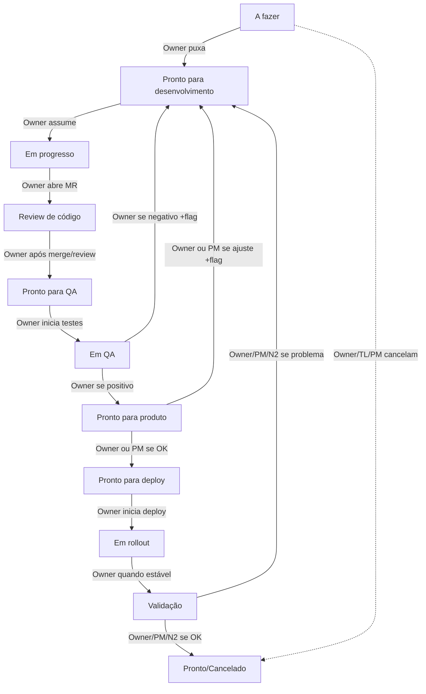

> **Applies to:** HUB: all | POSITION: all | AREA: all | SQUAD: all

# Regras de Fluxo Downstream — Responsáveis e Critérios

> Referência obrigatória ao mover cards no board (Jira, GitLab, Linear ou equivalente).
> Consultar antes de orientar o usuário sobre transição de status.

---

> Fonte de cargos: `taxonomy.md`. Este arquivo define o fluxo. Autonomia: o profissional que assumiu o card conduz ponta-a-ponta.

## Princípio de autonomia

Quem assumiu o card é o **owner** e pode avançar **todas** as transições abaixo.
TECH LEAD, PM e pares **revisam e apoiam** — não precisam clicar para o trabalho continuar.

Papéis no fluxo (ainda existem; não são cadeado):

| Papel no Fluxo | Positions | Papel |
|---|---|---|
| **Owner** | quem pegou o card: DEV, TECH LEAD ou PM | Conduz ponta-a-ponta |
| **DEV** | `JUNIOR`, `PLENO`, `SENIOR`, `SPECIALIST` | Entrega técnica |
| **TECH LEAD** | `TECH LEAD` | Apoia priorização, review e deploy quando pedido |
| **PM** | `PM`, `TPM`, `GPM` | Apoia aceite de produto quando pedido |
| **QA** | `QA-ENGINEER` | Executa testes em apoio; não bloqueia o owner |
| **N2** | Tech Analyst / suporte | Validação operacional se o time tiver esse papel |

## Diagrama do Fluxo

---

## Matriz de Transições (Quem move o quê)

Default: **Owner do card**. TL/PM podem mover também (apoio), nunca como bloqueio.

| De | Para | Quem move | Quando mover |
|---|---|---|---|
| **A fazer** | Pronto para desenvolvimento | **Owner** (DEV, TL ou PM) | Quando o card estiver claro o bastante para puxar |
| **Pronto para desenvolvimento** | Em progresso | **Owner** | Quando assumir e começar |
| **Em progresso** | Review de código | **Owner** | Quando abrir MR pronto para revisão |
| **Review de código** | Pronto para QA | **Owner** | Após merge ou review (qualquer revisor; TL não é obrigatório) |
| **Pronto para QA** | Em QA | **Owner** | Quando iniciar testes |
| **Em QA** | Pronto para produto | **Owner** | Resultado positivo |
| **Em QA** | Pronto para desenvolvimento | **Owner** | Resultado negativo — flag + comentário |
| **Pronto para produto** | Pronto para deploy | **Owner ou PM** | Aceite (owner pode auto-aceitar se PM não estiver no fluxo) |
| **Pronto para produto** | Pronto para desenvolvimento | **Owner ou PM** | Ajustes — flag + comentário |
| **Pronto para deploy** | Em rollout | **Owner** | Quando iniciar deploy |
| **Em rollout** | Validação | **Owner** | Deploy estável |
| **Validação** | Pronto/Cancelado | **Owner, PM ou N2** | Validação ok |
| **Validação** | Pronto para desenvolvimento | **Owner, PM ou N2** | Problema — comentário |
| **Qualquer etapa** | Pronto/Cancelado | **Owner, TL ou PM** | Cancelar com motivo |

---

## Responsabilidades no Fluxo

### Owner (DEV, TECH LEAD ou PM — quem assumiu)
- Puxa, implementa, abre MR, faz merge, valida, aceita e faz deploy do **próprio** card.
- Pede review/ajuda quando quiser — não é obrigatório esperar.

### TECH LEAD
- Apoia priorização, review e deploy **quando pedido**.
- Pode mover qualquer card (destravar, cancelar, cobrir férias).
- Não é gate: o DEV não espera o TL para avançar.

### DEV
- Dono da entrega ponta-a-ponta dos cards que assumiu.
- Pode escrever spec de produto, tech spec e subtarefas.

### QA
- Executa testes e reporta bugs em apoio ao owner.
- Não bloqueia o owner de avançar depois de registrar o resultado.

### PM / TPM / GPM
- Pode escrever spec, priorizar e aceitar.
- Pode assumir um card e conduzi-lo (incluindo handoff técnico).
- Aceite de produto é desejável, não cadeado: owner avança se PM não estiver no fluxo.

### N2
- Validação operacional pós-deploy **se o time tiver esse papel**.
- Owner pode encerrar o card se não houver N2.

---

## Detalhamento dos Estágios

### 1) A fazer — Owner: quem for puxar

**Objetivo:** fila saudável e "puxável".

**Pronto para entrar:**
- Contexto mínimo existe (objetivo, escopo, restrições, critérios de aceite).
- Dependências mapeadas (ou explicitamente "nenhuma").

**Saídas:** *Pronto para desenvolvimento* quando o profissional puxar (DEV, TL ou PM).

**Responsabilidades:**
- Owner (ou TL/PM se estiver refinando o backlog) deixa o card puxável.
- Não esperar o TL para puxar um card já claro.

---

### 2) Pronto para desenvolvimento — Owner: DEV

**Objetivo:** sinalizar que pode ser iniciado imediatamente.

**Pronto para entrar:**
- Critérios de aceite claros.
- Definição de "feito" acordada (testes, logs, métricas, migração, feature flag, etc.).

**Saídas:** *Em progresso* quando alguém pegar.

**Responsabilidades do DEV:**
- Assumir a entrega ponta-a-ponta do card (inclui QA/ajustes até pronto).

> O owner move para "Em progresso" ao assumir. Se o card ficar parado, qualquer DEV/TL/PM pode puxá-lo.

---

### 3) Em progresso — Owner: DEV

**Objetivo:** implementação ativa.

**Pronto para entrar:** card já assumido, branch/MR iniciados.

**Saídas:** *Review de código* quando houver MR pronto.

**Responsabilidades do DEV:**
- Comunicar riscos cedo (bloqueios, escopo estourando, dependências).
- Garantir checklist básico (lint/test/build, migrações, logs/telemetria quando aplicável).

---

### 4) Review de código — Owner: DEV

**Objetivo:** MR em revisão até merge.

**Pronto para entrar:**
- MR aberto, descrevendo mudança, riscos, como testar, rollback/flag quando aplicável.
- Link do ticket no MR.

**Saídas:** *Pronto para QA* após merge ou review.

**Responsabilidades do owner (autor do MR):**
- Pedir review quando fizer sentido; responder comentários; manter MR pequeno.
- Se review travar, o owner desbloqueia (pede ajuda ao TL/par — não fica parado esperando).

**Quem move para próxima etapa:** o owner (após merge ou revisão).

---

### 5) Pronto para QA — Owner: DEV

**Objetivo:** pacote pronto para validação (ambiente e instruções).

**Pronto para entrar:**
- Mudança disponível em ambiente de teste (ou release candidate preparado).
- Passo-a-passo de validação e critérios de aceite listados.

**Saídas:** *Em QA* quando DEV iniciar os testes e validação.

**Responsabilidades do DEV:**
- Garantir que existe build/ambiente e dados/seed (se necessário).
- Garantir instruções de teste.
- Mover para *Em QA* quando iniciar a validação.

---

### 6) Em QA — Owner: DEV

**Objetivo:** validar e corrigir até ficar ok.

**Pronto para entrar:** DEV executando testes ou validação em andamento.

**Saídas:**
- Volta para *Pronto para desenvolvimento* (se resultado negativo) — DEV adiciona flag e comentário.
- Vai para *Pronto para produto* quando resultado positivo.

**Responsabilidades do DEV:**
- Executar testes e validação (pode contar com apoio do QA).
- Se encontrar bugs/problemas, voltar para *Pronto para desenvolvimento* com flag e comentário claro.
- Manter ciclo curto (fix → reteste).
- Não jogar o card para outra pessoa só para mudar status — o owner avança.

> Se QA atuar, manter Owner: DEV (accountability de entrega) e definir "Executor: QA". Isso evita o limbo "QA é o dono então dev não corre".

---

### 7) Pronto para produto — Owner: quem entregou (PM apoia)

**Objetivo:** validação funcional/negócio.

**Pronto para entrar:**
- Validação técnica ok.
- Evidências quando fizer sentido.

**Saídas:** *Pronto para deploy* quando aprovado (pelo PM **ou** pelo owner se PM não estiver no fluxo).

**Responsabilidades:**
- PM valida comportamento quando estiver no fluxo.
- Owner pode auto-aceitar em times pequenos / se o aceite de produto não for um papel separado.
- Ajustes: volta para *Pronto para desenvolvimento* com flag e comentário.

---

### 8) Pronto para deploy — Owner: quem vai publicar

**Objetivo:** deploy consciente (rollback/flag quando necessário).

**Pronto para entrar:**
- Aceite feito (PM ou owner).
- Plano de deploy/rollback/flag quando o risco pedir.

**Saídas:** *Em rollout* quando iniciar deploy.

**Responsabilidades do owner:**
- Executar ou coordenar o deploy do próprio card.
- Pedir apoio ao TL em janela de risco — não é obrigatório.

---

### 9) Em rollout — Owner: quem publicou

**Objetivo:** rollout em execução e monitorado.

**Pronto para entrar:** deploy iniciado.

**Saídas:** *Validação* quando a mudança estiver ativa e estável.

**Responsabilidades do owner:**
- Monitorar métricas/logs/alertas; rollback se necessário.
- Comunicar status. Pedir ajuda ao TL em incidente.

---

### 10) Validação — Owner: quem publicou (PM/N2 apoiam)

**Objetivo:** validação operacional e de suporte (pós-deploy).

**Pronto para entrar:** feature ativa, checklist de validação disponível.

**Saídas:** *Pronto/Cancelado* quando validado (ou encerrado).

**Responsabilidades do N2:**
- Confirmar que a feature está funcionando no "mundo real".
- Se encontrar problema: voltar para *Pronto para desenvolvimento* com comentário objetivo do que falhou.
- Se validação OK: mover para *Pronto/Cancelado*.

---

### 11) Pronto/Cancelado — Owner: quem fechou o card

**Objetivo:** fechamento formal.

**Pronto para entrar:**
- Validado com sucesso **ou**
- Cancelado com motivo registrado.

**Responsabilidades:**
- Owner, TL ou PM registram motivo de cancelamento ou evidência de entrega.
- Qualquer um deles pode cancelar com motivo (prioridade/escopo).

---

## RACI

| Papel | Ação no fluxo |
|---|---|
| **Owner (DEV, TL ou PM)** | Conduz o card ponta-a-ponta. Move todas as transições do próprio trabalho. |
| **TECH LEAD** | Apoia. Pode mover qualquer card para destravar — não é gate. |
| **DEV** | Entrega técnica completa, inclusive spec/PR/deploy dos cards que assumiu. |
| **QA** | Testa e reporta. Não bloqueia o owner. |
| **PM / TPM / GPM** | Spec, priorização e aceite. Pode assumir e conduzir um card. |
| **N2** | Validação operacional se existir no time. |
