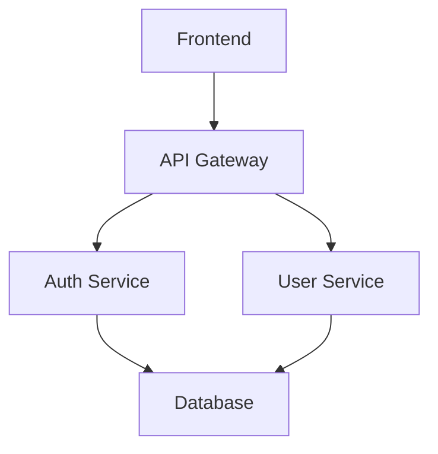
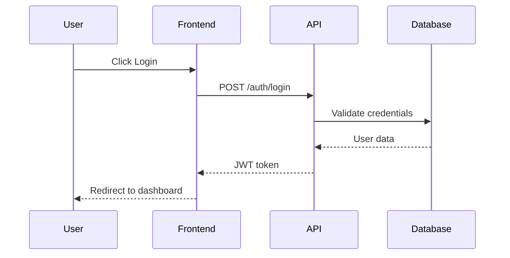
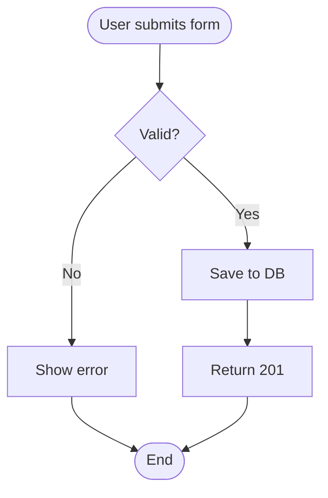

> **Applies to:** HUB: all | POSITION: all | AREA: all | SQUAD: all

# Regras de Tech Spec e Especificação Técnica

## Principais Regras

- Nunca invente dados ou informações. Se não souber, **não assuma nada**, pergunte para o usuário.
- Sempre siga as instruções de criação de tech spec na íntegra, seguindo os templates e workflows.
- Tech specs devem ser **auto-contidas**: um desenvolvedor deve poder executá-las sem precisar perguntar.
- Toda **decisão arquitetural deve ter justificativa documentada**.
- **Subtarefas devem ser fatias verticais completas** (endpoint inteiro, modal inteiro, tela inteira) com **mínimo 4h e máximo 1 dia** de trabalho. Nunca fatias horizontais (só enum, só repository, só factory). Se menor que 4h, agrupar com a próxima (sinal de fatia atômica). Se maior que 1 dia, quebrar em **duas fatias verticais independentes** — nunca em camadas.
- Sempre documente **riscos e mitigações** de forma explícita.

---

## Localização de Arquivos

> **NOTA**: Tech specs NÃO são salvas em `master-docs/`. São salvas na sessão do projeto e anexadas no Jira.

Arquivos são referenciados usando `$IDE/` que resolve automaticamente para a pasta do IDE atual (`.windsurf/`, `.claude/`, `.cursor/`).

---

## Arquivos de Instruções e Comandos

Sempre siga as instruções de acordo com as relações abaixo:

### Workflows de Tech Spec

- **import `$IDE/workflows/engineering/eng.build-tech-spec.md`**: Criação de tech spec a partir de história do Jira
- **import `$IDE/workflows/engineering/eng.breakdown-subtasks.md`**: Quebra de tech spec em subtarefas executáveis
- **import `$IDE/workflows/engineering/eng.start.md`**: Início de desenvolvimento de feature (referência)
- **import `$IDE/workflows/engineering/eng.plan.md`**: Planejamento de execução (referência)

### Templates

- **import `$IDE/templates/engineering/tech-spec-template.md`**: Template completo de tech spec

### Regras

- **import `$IDE/rules/engineering/eng.tech-spec-rules.md`**: Regras específicas de tech spec (este arquivo)

---

## Estrutura de Arquivos de Tech Spec

### Localização

Tech specs devem ser salvas na **sessão do projeto** (NÃO em master-docs):

```
$SESSION_FOLDER/{TASK_MANAGER_KEY}/tech-spec.md
```

> 📁 **Padrão**: O `TASK_MANAGER_KEY` deve ser o ID do card em **lowercase**.

**Exemplos:**

- `$SESSIONS_DIR/eng/task-123/tech-spec.md`
- `$SESSIONS_DIR/eng/story-456/tech-spec.md`
- `$SESSIONS_DIR/eng/bug-789/tech-spec.md`

### Por que na sessão?

1. **Anexo no Jira**: A tech spec é anexada diretamente na issue do Jira como fonte da verdade
2. **Sessão temporária**: A sessão é usada durante o desenvolvimento e pode ser limpa depois
3. **Evita poluição**: Não cria arquivos permanentes no repositório de código
4. **Rastreabilidade**: O Jira é o sistema oficial de documentação de tasks

### Nomenclatura

- **Formato da pasta**: `{jira-key}` em **lowercase** (ex: `TASK-123` → `task-123`)
- **Arquivo**: Sempre `tech-spec.md` ou `architecture.md`
- **Exemplo**: `$SESSIONS_DIR/eng/task-123/tech-spec.md`

> ⚠️ **IMPORTANTE**: NÃO adicione descrições ou sufixos ao nome da pasta.
> Use **apenas** o TASK_MANAGER_KEY convertido para lowercase.

---

## Princípios de Tech Spec

### 1. Rastreabilidade Total

**Princípio**: Toda tech spec deve ser rastreável até a história de negócio original.

**O que isso significa:**

- Link para história do Jira no topo do documento
- Referência aos critérios de aceitação de produto
- Conexão clara entre requisitos de negócio e decisões técnicas
- IDs de subtarefas vinculadas à história pai

**Validação:**

- [ ] Link para Jira funciona
- [ ] Critérios de aceitação de produto estão documentados
- [ ] Cada subtarefa referencia a tech spec
- [ ] Tech spec referencia PRD/FRD se existirem

**Exemplo:**

```markdown
## ✅ Bom:

related_story: STORY-123
link_task: https://jira.empresa.com/browse/STORY-123
related_prd: Sistema de Autenticação (link)

---

## ❌ Ruim:

related_story: história do jira
link_task: (não preenchido)

---
```

---

### 2. Decisões Justificadas

**Princípio**: Toda decisão arquitetural deve ter contexto, alternativas e justificativa.

**Estrutura Obrigatória para Decisões:**

```markdown
Decisão: {Título da decisão}

Contexto:
{Por que precisamos decidir isso? Qual problema estamos resolvendo?}

Opções Consideradas:

- Opção A: {descrição}
  - Prós: {vantagens}
  - Contras: {desvantagens}
  - Trade-offs: {o que ganhamos/perdemos}

- Opção B: {descrição}
  - Prós: {vantagens}
  - Contras: {desvantagens}
  - Trade-offs: {o que ganhamos/perdemos}

Decisão: {Opção escolhida}

Justificativa:
{Por que escolhemos esta opção? Quais critérios usamos?}

Consequências:
{Impactos positivos e negativos desta decisão}
```

**Validação:**

- [ ] Pelo menos 2 alternativas foram consideradas
- [ ] Prós e contras estão documentados
- [ ] Justificativa é clara e objetiva
- [ ] Consequências (positivas e negativas) estão documentadas

**Exemplo:**

```markdown
✅ Bom:
Decisão: Armazenamento de Tokens JWT

Contexto: Precisamos decidir onde armazenar tokens JWT no frontend
para manter usuários autenticados.

Opções Consideradas:

- Opção A: localStorage
  - Prós: Persistente, simples de implementar
  - Contras: Vulnerável a XSS, não expira automaticamente
  - Trade-offs: Conveniência vs. Segurança

- Opção B: httpOnly cookies
  - Prós: Proteção contra XSS, gerenciado pelo browser
  - Contras: Vulnerável a CSRF (mitigável), requer backend configurado
  - Trade-offs: Segurança vs. Complexidade

Decisão: httpOnly cookies

Justificativa: Segurança é prioridade P0. CSRF pode ser mitigado com
tokens CSRF. XSS é vetor de ataque mais comum e perigoso.

Consequências:

- (+) Proteção robusta contra XSS
- (+) Tokens expiram automaticamente
- (-) Requer implementação de proteção CSRF
- (-) Mais complexo em ambientes multi-domínio

❌ Ruim:
Decisão: Usar JWT
Justificativa: É melhor que sessões.
```

---

### 3. Subtarefas Executáveis

**Princípio**: Cada subtarefa é um **entregável completo e independente** (fatia vertical), executável por um desenvolvedor em **4h a 1 dia** sem precisar de contexto adicional. Terá sua própria branch, seu próprio commit e seu próprio deploy — portanto, precisa ser mergeável isoladamente sem quebrar o sistema.

**Características de Subtarefa Bem Definida:**

1. **Entregabilidade Independente (fatia vertical)** — PRÉ-REQUISITO ABSOLUTO
   - É um entregável completo end-to-end: endpoint inteiro, modal inteiro, tela inteira
   - Atravessa todas as camadas necessárias na MESMA subtarefa (migration + DTO + enum + use-case + factory + repository + controller + testes; ou tipos + hooks + integração + componente + estilos + testes no frontend)
   - Mergeada isoladamente, a aplicação continua funcionando
   - A entrega é observável: testável, demonstrável ou verificável
   - **Nunca** é uma fatia horizontal (só enum, só repository, só factory, só DTO, só contratos)

2. **Título Claro e Acionável**
   - Usa verbo de ação: Criar, Implementar, Adicionar, Atualizar
   - Específico sobre o que fazer
   - Não genérico ou vago

3. **Descrição Completa**
   - O QUE fazer
   - COMO fazer (direcionalmente)
   - POR QUE fazer (contexto)

4. **Arquivos Explícitos**
   - Lista de arquivos a modificar/criar
   - Tipo de mudança (Modificação/Criação/Remoção)
   - Breve descrição da mudança

5. **Critérios Testáveis**
   - Critérios de aceitação verificáveis
   - Como validar que está pronto
   - Não vago ("funcionar bem")

6. **Testes Definidos**
   - Quais testes unitários criar
   - Quais testes de integração criar
   - Casos de teste específicos

7. **Dependências Mapeadas**
   - O que precisa estar pronto antes (outras fatias verticais completas, nunca camadas isoladas)
   - O que esta subtarefa bloqueia

**Template de Validação:**

```
[ ] É uma fatia vertical completa (endpoint inteiro, modal inteiro, tela inteira)
[ ] Mergeada isoladamente, o sistema continua funcionando
[ ] A entrega é observável (testável ou demonstrável)
[ ] Título é específico e acionável
[ ] Descrição tem O QUE, COMO e POR QUE
[ ] Arquivos afetados estão listados
[ ] Critérios de aceitação são testáveis
[ ] Testes necessários estão definidos
[ ] Dependências estão mapeadas (outras fatias verticais, não camadas)
[ ] Estimativa entre 4h e 1 dia
[ ] Um dev pode executar sem perguntas adicionais
```

**Exemplo:**

```markdown
✅ Bom:

### SUBTASK-003: Criar endpoint POST /api/users com validação de email

Descrição:
Implementar endpoint de criação de usuários que valida formato de email
antes de persistir no banco. Retorna 400 se email inválido.

Arquivos a Modificar/Criar:

- `backend/routes/users.py` - [Criação] - Novo endpoint POST /api/users
- `backend/validators/email.py` - [Criação] - Função de validação de email
- `backend/tests/test_users.py` - [Criação] - Testes do endpoint

Critérios de Aceitação:

- [ ] POST /api/users aceita {name, email, password}
- [ ] Valida formato de email com regex padrão RFC 5322
- [ ] Retorna 400 com mensagem se email inválido
- [ ] Retorna 201 com user criado se válido
- [ ] Hash de senha usando bcrypt

Testes Requeridos:

- [ ] test_create_user_valid_email() - email válido retorna 201
- [ ] test_create_user_invalid_email() - email inválido retorna 400
- [ ] test_create_user_duplicate_email() - email duplicado retorna 409

Dependências: SUBTASK-002 (migration users)
Estimativa: 1.5h

❌ Ruim:

### SUBTASK-003: Implementar API de usuários

Descrição: Criar API para gerenciar usuários

Critérios: API deve funcionar
Testes: Testar tudo
```

---

### 4. Riscos Documentados

**Princípio**: Riscos devem ser identificados proativamente com mitigações e planos B.

**Estrutura de Documentação de Riscos:**

| Risco                  | Probabilidade    | Impacto          | Mitigação             | Plano B                  |
| ---------------------- | ---------------- | ---------------- | --------------------- | ------------------------ |
| {Descrição específica} | Alta/Média/Baixa | Alto/Médio/Baixo | {Como reduzir/evitar} | {Alternativa se ocorrer} |

**Categorias de Riscos Comuns:**

1. **Riscos Técnicos**
   - Performance degradada
   - Complexidade subestimada
   - Incompatibilidade de bibliotecas
   - Débito técnico introduzido

2. **Riscos de Dependências**
   - API de terceiros instável
   - Mudanças em dependências externas
   - Bloqueios por outras histórias

3. **Riscos de Dados**
   - Migração complexa
   - Perda de dados
   - Inconsistência de estado

4. **Riscos de Segurança**
   - Vulnerabilidades introduzidas
   - Dados sensíveis expostos
   - Autenticação/Autorização mal implementada

**Validação:**

- [ ] Pelo menos 3 riscos identificados
- [ ] Probabilidade e impacto avaliados
- [ ] Mitigação definida para cada risco
- [ ] Plano B existe para riscos críticos (Alto impacto)

**Exemplo:**

```markdown
✅ Bom:
| Risco | Probabilidade | Impacto | Mitigação | Plano B |
|-------|---------------|---------|-----------|---------|
| API de pagamento de terceiros instável causa timeouts | Média | Alto | Implementar retry com backoff exponencial (3 tentativas). Timeout de 5s. Circuit breaker após 5 falhas. | Fila assíncrona: salvar pagamento pendente, processar em background, notificar usuário quando concluir |
| Migration de dados falha em produção deixando DB inconsistente | Baixa | Crítico | Testar migration em cópia de prod. Criar script de rollback. Backup antes de executar. Validação pós-migration. | Script de rollback automático. Restore de backup. Feature flag para desabilitar feature. |

❌ Ruim:
| Risco | Probabilidade | Impacto | Mitigação | Plano B |
|-------|---------------|---------|-----------|---------|
| Algo pode dar errado | Não sei | Alto | Testar bem | Voltar atrás |
```

---

### 5. Estimativas Realistas

**Princípio**: Estimativas devem incluir implementação, testes, code review e buffer para imprevistos.

**Componentes da Estimativa:**

```
Estimativa de Subtarefa =
  + Tempo de implementação
  + Tempo de testes (unitários + integração)
  + Tempo de code review e ajustes
  + Buffer (10-20%)
```

**Regras:**

- **Mínimo por subtarefa**: 4h (abaixo disso é sinal forte de fatia horizontal atômica; agrupar com a próxima)
- **Máximo por subtarefa**: até 1 dia de trabalho
- **Ideal**: 4-6h

**Se > 1 dia** → quebrar em **duas fatias verticais independentes** (ex: dois endpoints distintos, duas telas distintas), **nunca** em fatias horizontais (camada de dados vs camada de API).

**Se < 4h** → agrupar com a próxima subtarefa até ultrapassar 4h formando uma fatia vertical completa.

**Estimativa Total:**

```
Estimativa Bruta = Soma de todas as subtarefas
Buffer = 25-30% (para imprevistos, discussões, blockers)
Estimativa Final = Estimativa Bruta * 1.25
```

**Validação:**

- [ ] Cada subtarefa tem estimativa em horas
- [ ] Toda subtarefa tem ≥ 4h e ≤ 1 dia
- [ ] Toda subtarefa é uma fatia vertical completa (nunca horizontal)
- [ ] Estimativa total inclui buffer de 25-30%
- [ ] Estimativa total bate com expectativa da história original

**Exemplo:**

```markdown
✅ Bom:
Fase 1: Setup (3.5h)

- SUBTASK-001: Instalar dependências - 0.5h
- SUBTASK-002: Criar migration - 1h
- SUBTASK-003: Configurar env vars - 1h
- SUBTASK-004: Testes de setup - 1h

Total Fases: 18h
Buffer (25%): +4.5h
Estimativa Final: 22.5h (~3 dias úteis)

❌ Ruim:
Fase 1: Setup

- SUBTASK-001: Fazer setup do backend - 5h (muito grande!)
- SUBTASK-002: Configurar coisas - ??? (sem estimativa)

Total: Uns 3 dias (vago, sem quebra)
```

---

### 6. Testes Abrangentes

**Princípio**: Estratégia de testes deve cobrir unitário, integração e E2E com critérios claros.

**Pirâmide de Testes Esperada:**

```
       /\
      /  \  E2E (10-20%)
     /    \
    /______\ Integração (20-30%)
   /        \
  /__________\ Unitários (50-70%)
```

**Para Cada Nível:**

**Testes Unitários:**

- [ ] Testar funções/métodos isoladamente
- [ ] Mockar dependências externas
- [ ] Cobertura mínima: 80% do código novo
- [ ] Casos: caminho feliz + edge cases + erros

**Testes de Integração:**

- [ ] Testar integração entre módulos
- [ ] Testar integrações com banco (usar DB de teste)
- [ ] Testar integrações com APIs externas (mockar ou sandbox)
- [ ] Validar contratos entre componentes

**Testes E2E:**

- [ ] Testar fluxos críticos de usuário
- [ ] Usar dados realistas
- [ ] Validar funcionalidade completa
- [ ] Automatizar cenários de regressão

**Testes de Performance** (se aplicável):

- [ ] Load testing: simular N usuários concorrentes
- [ ] Stress testing: encontrar limite do sistema
- [ ] Validar SLAs (ex: API < 200ms p95)

**Testes de Segurança** (se aplicável):

- [ ] OWASP Top 10 verificado
- [ ] Scan de vulnerabilidades
- [ ] Penetration testing básico

**Exemplo:**

```markdown
✅ Bom:

### Estratégia de Testes

**Cobertura Alvo**: 85%

**Testes Unitários** (15 testes):

- `test_validate_email_valid()` - Email válido retorna True
- `test_validate_email_invalid_format()` - Email sem @ retorna False
- `test_validate_email_empty()` - Email vazio levanta ValueError
- `test_hash_password()` - Senha é hasheada com bcrypt
- `test_verify_password_correct()` - Senha correta retorna True
- ... (mais 10 testes)

**Testes de Integração** (5 testes):

- `test_create_user_persists_to_db()` - User criado é salvo no DB
- `test_create_user_duplicate_email_raises()` - Email duplicado levanta IntegrityError
- `test_login_returns_jwt()` - Login bem-sucedido retorna JWT válido
- ... (mais 2 testes)

**Testes E2E** (3 testes):

- `test_user_signup_and_login_flow()` - Signup → Login → Acessa dashboard
- `test_password_reset_flow()` - Reset → Email → Nova senha → Login
- `test_invalid_login_shows_error()` - Credenciais erradas → Mensagem de erro

**Testes de Performance**:

- Load: 100 usuários concorrentes fazendo login
- Meta: p95 < 500ms, p99 < 1s
- Ferramenta: k6

❌ Ruim:
Testes: Vamos testar tudo bem.
Cobertura: O máximo possível.
```

---

### 7. Documentação Completa

**Princípio**: Documentação deve ser atualizada como parte da implementação, não depois.

**Documentação Obrigatória:**

**README.md:**

- [ ] Atualizar se feature muda setup
- [ ] Adicionar novas variáveis de ambiente
- [ ] Atualizar instruções de instalação

**API.md (se aplicável):**

- [ ] Documentar novos endpoints
- [ ] Especificar request/response
- [ ] Exemplos de uso
- [ ] Códigos de erro

**ARCHITECTURE.md (se mudança arquitetural):**

- [ ] Atualizar diagramas
- [ ] Documentar novas decisões
- [ ] Explicar trade-offs

**CHANGELOG.md:**

- [ ] Adicionar entry para a versão
- [ ] Seguir formato Keep a Changelog

**Comentários no Código:**

- [ ] Decisões não-óbvias explicadas
- [ ] Algoritmos complexos comentados
- [ ] TODOs com contexto e deadline
- [ ] Evitar comentários óbvios

**Validação:**

- [ ] Documentação é parte dos critérios de aceitação
- [ ] Links para docs externas funcionam
- [ ] Exemplos de código são válidos e testados
- [ ] Linguagem clara e objetiva

**Exemplo:**

```markdown
✅ Bom (em subtarefa):
Critérios de Aceitação:

- [ ] Código implementado e revisado
- [ ] Testes passando
- [ ] README.md atualizado com nova env var JWT_SECRET
- [ ] API.md documentado com endpoint POST /auth/login
- [ ] CHANGELOG.md atualizado

❌ Ruim:
Critérios de Aceitação:

- [ ] Código pronto
- [ ] Testes ok
      (documentação esquecida)
```

---

## Formato Markdown e Estrutura

### Metadados de Tech Spec

Use formato YAML frontmatter:

```yaml
---
name: { nome descritivo da tech spec }
id: { TECH-001 }
related_story: { STORY-XXX do Jira }
epic_related: { EPIC-XXX se existir }
link_task: { URL da história no Jira }
created_at: { YYYY-MM-DD }
updated_at: { YYYY-MM-DD }
status: { Draft, In Review, Approved, Implemented }
author: { nome do autor }
reviewers: { lista de revisores }
---
```

### Diagramas Mermaid

Use Mermaid para visualizações:

**Diagrama de Arquitetura:**



**Diagrama de Sequência:**



**Diagrama de Fluxo:**



### Tabelas

Use tabelas para informações estruturadas:

**Componentes Afetados:**
| Componente | Tipo de Mudança | Impacto | Prioridade |
|------------|-----------------|---------|------------|
| Auth Service | Modificação | Alto | P0 |
| User API | Criação | Médio | P1 |

**Riscos:**
| Risco | Probabilidade | Impacto | Mitigação | Plano B |
|-------|---------------|---------|-----------|---------|
| ... | ... | ... | ... | ... |

### Code Blocks

Use blocos de código com linguagem especificada:

```python
# Bom
def validate_email(email: str) -> bool:
    """Valida formato de email usando regex."""
    pattern = r'^[\w\.-]+@[\w\.-]+\.\w+$'
    return re.match(pattern, email) is not None
```

### Links

Use links markdown para referências:

```markdown
- [PRD: Sistema de Autenticação](../product/auth-prd.md)
- [ADR-001: Escolha de JWT](../technical/adr/001-jwt-auth.md)
- [História Original](https://jira.empresa.com/browse/STORY-123)
```

---

## Validação de Tech Spec

### Checklist de Revisão

Use este checklist antes de finalizar uma tech spec:

**Conteúdo Obrigatório:**

- [ ] Metadados completos (frontmatter YAML)
- [ ] Contexto da história de negócio
- [ ] Análise técnica detalhada
- [ ] Componentes afetados identificados
- [ ] Decisões arquiteturais documentadas com justificativas
- [ ] Plano de implementação faseado
- [ ] Subtarefas detalhadas (fatia vertical, 4h a 1 dia cada)
- [ ] Dependências mapeadas
- [ ] Riscos identificados com mitigações
- [ ] Estratégia de testes definida
- [ ] Considerações de segurança
- [ ] Considerações de performance
- [ ] Documentação a atualizar

**Qualidade:**

- [ ] Linguagem clara e objetiva
- [ ] Sem jargões sem definição
- [ ] Diagramas úteis e legíveis
- [ ] Links funcionam
- [ ] Exemplos de código são válidos
- [ ] Estimativas realistas
- [ ] Sem ambiguidades críticas
- [ ] Rastreável até história original

**Subtarefas:**

- [ ] Todas têm entre 4h e 1 dia de trabalho
- [ ] Todas são fatias verticais completas (nenhuma horizontal)
- [ ] Títulos claros e acionáveis
- [ ] Descrições completas (O QUE, COMO, POR QUE)
- [ ] Arquivos afetados listados
- [ ] Critérios de aceitação testáveis
- [ ] Testes definidos
- [ ] Dependências mapeadas

**Decisões:**

- [ ] Pelo menos 2 alternativas consideradas
- [ ] Prós e contras documentados
- [ ] Justificativa clara
- [ ] Consequências documentadas

**Riscos:**

- [ ] Pelo menos 3 riscos identificados
- [ ] Probabilidade e impacto avaliados
- [ ] Mitigação para cada risco
- [ ] Plano B para riscos críticos

---

## Integração com Jira

### Criação de Subtarefas

**Formato de Descrição no Jira:**

Use markdown compatível com Jira:

```markdown
h2. Descrição
{Descrição técnica detalhada}

h2. Arquivos a Modificar/Criar

- {{path/to/file1.py}} - _[Modificação]_ - {Descrição}
- {{path/to/file2.tsx}} - _[Criação]_ - {Descrição}

h2. Critérios de Aceitação

- {color:green}✓{color} {Critério 1}
- {color:green}✓{color} {Critério 2}

h2. Testes Requeridos
_Unitários:_

- {{test_funcao()}} - {descrição}

h2. Dependências

- Depende de: [SUBTASK-XXX|https://jira.../SUBTASK-XXX]

h2. Referências

- [Tech Spec|{link}]
- [História Original|{link}]
```

### Metadados de Subtarefa no Jira

- **Tipo**: Subtarefa
- **História Pai**: STORY-XXX
- **Prioridade**: P0/P1/P2/P3
- **Estimativa**: Xh (em horas)
- **Labels**: `tech-spec`, `{área}` (backend, frontend, etc.), `{tipo}` (feature, bugfix, etc.)
- **Componentes**: {Componente do sistema afetado}
- **Sprint**: {Sprint atual ou próximo}

### Vinculação de Dependências

Use links do Jira para dependências:

- **Blocks**: Esta subtarefa bloqueia SUBTASK-XXX
- **Is Blocked By**: Esta subtarefa é bloqueada por SUBTASK-XXX
- **Relates To**: Esta subtarefa se relaciona com SUBTASK-XXX

---

## Manutenção de Tech Specs

### Quando Atualizar

Tech specs devem ser atualizadas quando:

- [ ] Decisões arquiteturais mudam durante implementação
- [ ] Novos riscos são identificados
- [ ] Escopo da história muda
- [ ] Dependências são alteradas
- [ ] Estimativas provam estar incorretas

### Versionamento

Use seção de **Histórico de Revisões**:

| Data       | Versão | Autor        | Mudanças                                              |
| ---------- | ------ | ------------ | ----------------------------------------------------- |
| 2024-01-15 | 1.0    | João Silva   | Versão inicial                                        |
| 2024-01-20 | 1.1    | Maria Santos | Adicionado risco de performance, ajustado estimativas |
| 2024-01-25 | 2.0    | João Silva   | Mudança arquitetural: JWT → OAuth2                    |

### Status do Documento

Atualize o status no frontmatter:

- **Draft**: Em elaboração
- **In Review**: Aguardando revisão
- **Approved**: Aprovado para implementação
- **Implemented**: Implementação concluída
- **Archived**: Arquivado (histórico)

---

## Antipadrões - O Que Evitar

### ❌ Tech Spec Genérica

```markdown
# Tech Spec: Implementar Login

Vamos implementar login de usuários.

Subtarefas:

- Fazer backend
- Fazer frontend
- Testar
```

**Problemas:**

- Sem contexto de negócio
- Sem decisões arquiteturais
- Subtarefas muito vagas e grandes
- Sem critérios de aceitação
- Sem riscos identificados

---

### ❌ Decisões Sem Justificativa

```markdown
Decisão: Vamos usar MongoDB

Justificativa: Porque é NoSQL e escalável.
```

**Problemas:**

- Sem alternativas consideradas
- Justificativa superficial
- Sem trade-offs documentados
- Sem contexto do porquê NoSQL

---

### ❌ Subtarefas Muito Grandes

```markdown
SUBTASK-001: Implementar sistema de autenticação completo (3 dias)
```

**Problemas:**

- Muito grande (> 1 dia) — múltiplos endpoints e telas em uma única subtarefa
- Não específica
- Difícil de estimar
- Difícil de testar incrementalmente

**Correção**: dividir em fatias verticais independentes, ex: `[BACKEND] Endpoint POST /auth/register`, `[BACKEND] Endpoint POST /auth/login`, `[FRONTEND] Tela de registro`, `[FRONTEND] Tela de login` — **nunca** em camadas (`[BACKEND] Schemas`, `[BACKEND] Controllers`, etc).

---

### ❌ Estimativas Sem Base

```markdown
Estimativa Total: Uns 2-3 dias
```

**Problemas:**

- Sem quebra por subtarefa
- Sem buffer
- Muito vaga

---

### ❌ Riscos Ignorados

```markdown
Riscos: Nenhum identificado.
```

**Problemas:**

- Todo projeto tem riscos
- Falta de análise crítica
- Equipe não preparada para problemas

---

## Recursos e Referências

### Templates

- import `$IDE/templates/engineering/tech-spec-template.md`

### Workflows

- import `$IDE/workflows/engineering/eng.build-tech-spec.md`
- import `$IDE/workflows/engineering/eng.breakdown-subtasks.md`

### Documentação Relacionada

- import `$IDE/rules/product/prod-rules.md` - Regras de produto (complementar)
- `docs/technical/adr/` - Architecture Decision Records

### Ferramentas

- **Mermaid**: https://mermaid.js.org/
- **Jira**: Sistema de task management
- **Markdown**: Formato de documentação

---

## Exemplo Completo

Ver arquivo de template:
import `$IDE/templates/engineering/tech-spec-template.md`

---

**Lembre-se**: Uma tech spec bem feita economiza horas de discussão e retrabalho. Invista tempo na elaboração.
