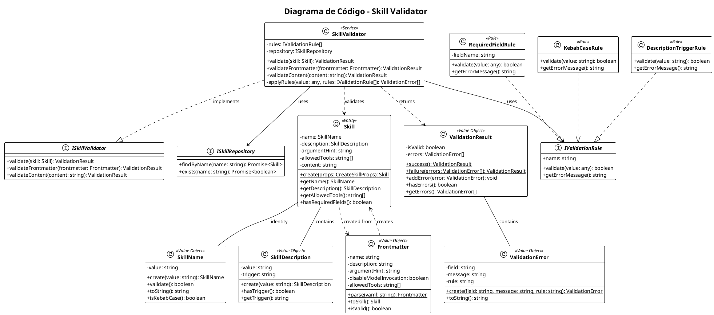

# Code - Skill Validator

## Visão Geral

Diagrama de código (Nível 4) do componente Skill Validator, mostrando as classes e interfaces responsáveis por validar a estrutura dos skills.

> **Nota**: Este nível é raramente usado. Documentado aqui apenas como exemplo de referência para algoritmos complexos ou padrões críticos.

## Diagrama

## Elementos

| Elemento | Tipo | Descrição | Responsabilidade |
|----------|------|-----------|------------------|
| ISkillValidator | Interface | Contrato de validação de skills | Define métodos de validação |
| IValidationRule | Interface | Contrato de regra de validação | Define estrutura de regras |
| ISkillRepository | Interface | Contrato de repositório | Acesso a skills existentes |
| SkillName | Value Object | Nome do skill | Validação de formato kebab-case |
| SkillDescription | Value Object | Descrição com trigger | Extração de trigger de uso |
| Skill | Entity | Entidade principal | Representa um skill completo |
| Frontmatter | Value Object | Metadados YAML | Parse e validação de frontmatter |
| ValidationResult | Value Object | Resultado da validação | Agrupa erros encontrados |
| ValidationError | Value Object | Erro individual | Representa um erro específico |
| RequiredFieldRule | Rule | Regra de campo obrigatório | Valida presença de campo |
| KebabCaseRule | Rule | Regra de formato | Valida formato kebab-case |
| DescriptionTriggerRule | Rule | Regra de trigger | Valida presença de "Use quando" |
| SkillValidator | Service | Serviço de validação | Orquestra validação completa |

## Padrões Utilizados

| Padrão | Onde | Por quê |
|--------|------|---------|
| Value Object | SkillName, ValidationResult | Imutabilidade e validação no construtor |
| Strategy | IValidationRule | Regras intercambiáveis |
| Repository | ISkillRepository | Abstração de acesso a dados |
| Result Object | ValidationResult | Evita exceções para fluxo de validação |

## ADRs Relacionados

| ADR | Título | Impacto |
|-----|--------|---------|
| ADR-005 | Padrão de validação | Define uso de Result Object |
| ADR-006 | Value Objects para domínio | Define imutabilidade |

## Changelog

### [2025-01-24] - v1.0
- Criação: Diagrama de código do Skill Validator
- Motivo: Documentar padrões de validação como referência
