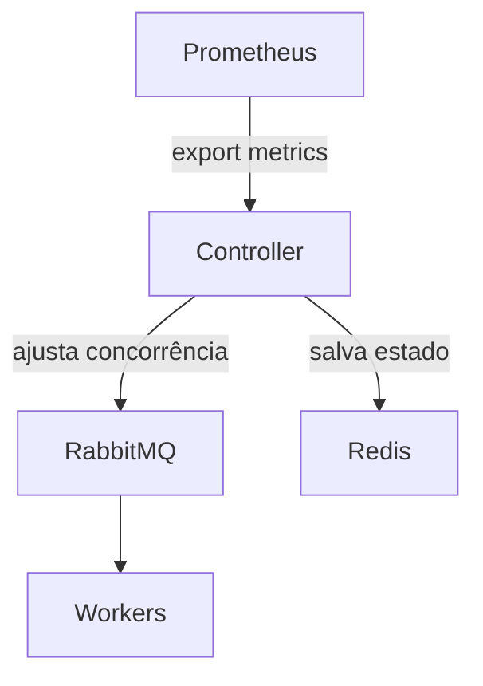

# 🧱 ARD Template — Architecture Requirement Document

**Arquivo:** /docs/engineering/ARD/ARD-xxx-nome-da-arquitetura.md

---

## 🏗️ ARD-[número] — [Título da Arquitetura]

**Status:** Proposta / Em desenvolvimento / Em validação / Finalizada  
**Data:** [dd/mm/yyyy]  
**Autor:** [Tech Lead / Arquiteto responsável]  
**Revisores:** [Chapter Leads, Eng. de Plataforma, etc.]  
**Relacionado a:** [RFC-xxx], [FRD-xxx], [PRD-xxx]  
**Versão:** [1.0]

---

### 🔗 Referência ao PRD (obrigatório quando existir)

- **Referência:** PRD-xxx – [Título]
- **Arquivo/rota:** [link ou caminho do arquivo do PRD]

#### Legenda (tipos de requisito)

- **RF**: Requisito Funcional (comportamento/capacidade do sistema)
- **NFR**: Requisito Não Funcional (qualidade: performance, disponibilidade, segurança, etc.)
- **Restrição**: Limitação obrigatória (técnica/negócio/infra/processo) que guia a solução
- **SLA**: Service Level Agreement (meta/compromisso mensurável de nível de serviço)
- **Métrica**: Indicador de sucesso/monitoramento (KPI/SLI) usado para medir resultado

#### Requisitos do PRD consumidos diretamente por este ARD

| ID | Tipo (RF/NFR/Restrição/SLA/Métrica) | Origem (FRD/PRD) | Descrição | Como impacta a arquitetura |
|----|-------------------------------------|------------------|-----------|----------------------------|

### 🎯 Objetivo
<!-- Descreva o propósito e metas técnicas -->

---

### 🚫 O que não é papel deste ARD

- Redefinir objetivo de produto
- Mudar regra de negócio
- Criar feature nova “porque tecnicamente é melhor”
- Discutir roadmap ou priorização

> Se algo disso aparecer, é sinal de PRD mal definido ou incompleto. Pausar e validar com Produto/usuário antes de seguir.

---

### 🧠 Premissas e Restrições

- Deve operar dentro do cluster GKE atual  
- Sem dependência de serviços externos  
- Limite de CPU total de 6vCPU

---

### ⚙️ Desenho da Arquitetura

---

### 🧩 Componentes Principais

| Componente | Função | Responsável |
|-------------|--------|--------------|

---

### 🔄 Fluxos de Dados

| Fluxo | Origem | Destino | Dados | Garantias (ordem/entrega) |
|------|--------|---------|------|----------------------------|

---

### 🔌 Integrações

| Integração | Tipo | Direção | Autenticação/Autorização | Observações |
|----------|------|---------|---------------------------|-------------|

---

### 📜 Contratos (APIs, eventos, filas)

#### APIs

| Endpoint | Método | Request | Response | Erros | Autenticação | Observações |
|----------|--------|---------|----------|-------|--------------|-------------|

#### Eventos

| Evento | Publisher | Consumers | Schema/Versão | Chave de idempotência | Observações |
|-------|-----------|-----------|---------------|------------------------|-------------|

#### Filas / Tópicos

| Recurso | Tipo | Producer | Consumers | DLQ/Retry | Ordenação | Observações |
|---------|------|----------|-----------|----------|-----------|-------------|

---

### 🔐 Segurança e Compliance

- Autenticação via Service Account GCP  
- Secrets gerenciados pelo Secret Manager  
- Logs e métricas auditáveis no Stackdriver

---

### 📊 Métricas e Observabilidade

- queue_backlog_total  
- rebalance_iterations  
- consumer_restarts

---

### ⚖️ Escalabilidade e Resiliência

- Controlador roda em pod único com HPA mínimo 1 / máximo 3  
- Retry backoff exponencial  
- Fallback para configuração manual via Redis

---

### 🧠 Decisões Técnicas e Trade-offs

| Decisão | Referência no PRD (RF/NFR/Restrição/SLA/Métrica) | Alternativas consideradas | Trade-offs | Decisão final |
|--------|-----------------------------------------------|----------------------------|------------|--------------|

---

### ⚔️ Riscos e Mitigações

| Risco | Mitigação |
|-------|------------|

---

### ✅ Critérios de Sucesso

- Redistribuição dinâmica < 30s  
- Nenhum downtime detectado  
- Redução ≥ 25% no tempo médio de fila  
- Logs e métricas funcionais

---

### 🧩 Roadmap Técnico

| Etapa | Responsável | Status |
|-------|--------------|--------|

---

### 🏗️ Como vamos construir isso de forma segura, escalável e sustentável?

#### Segurança

| Medida | Como aplicar | Validação |
|--------|-------------|----------|

#### Escalabilidade

| Medida | Como aplicar | Validação |
|--------|-------------|----------|

#### Sustentabilidade (manutenção e evolução)

| Medida | Como aplicar | Validação |
|--------|-------------|----------|

---

### 🧩 Anexos

- [RFC-xxx](../RFC/RFC-xxx.md)  
- [AVD-xxx](../AVD/AVD-xxx.md)

---

### 🏁 Conclusão
<!-- Resumo da decisão arquitetural final -->
