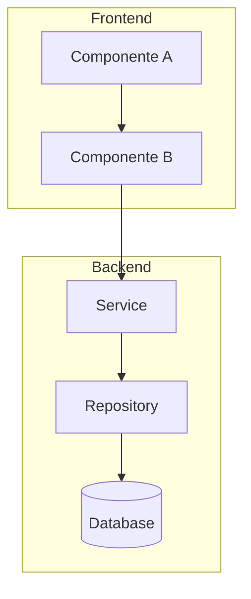

# Architecture: {TASK_MANAGER_KEY}

> 📁 **Sessão**: `$SESSIONS_DIR/eng/{TASK_MANAGER_KEY}/`
> 🎫 **Jira**: `{TASK_MANAGER_KEY}` (converta para lowercase no nome da pasta)

> **Criado em:** {DATA}  
> **Issue:** {JIRA_ISSUE_KEY}  
> **Status:** 🔄 Em Revisão | ✅ Aprovado | ❌ Rejeitado

---

## 1. Visão Geral

### 1.1 Contexto

{Descreva a motivação e o contexto de negócio por trás desta tarefa. Por que isso está sendo feito? Qual problema resolve?}

### 1.2 Objetivo

{Qual é o resultado esperado? O que o usuário/sistema poderá fazer após a implementação?}

### 1.3 Escopo

**Incluído:**

- {item incluído no escopo}
- {item incluído no escopo}

**Não incluído:**

- {item explicitamente fora do escopo}
- {item explicitamente fora do escopo}

### 1.4 Critérios de Sucesso

- [ ] {Critério mensurável 1}
- [ ] {Critério mensurável 2}
- [ ] {Critério mensurável 3}

---

## 2. Análise Técnica

### 2.1 Estado Atual (As-Is)

{Descreva como o sistema funciona hoje. Quais são os fluxos atuais? Quais componentes estão envolvidos?}

```
Fluxo atual (se aplicável):
1. {passo 1}
2. {passo 2}
3. {passo 3}
```

### 2.2 Estado Proposto (To-Be)

{Descreva como o sistema funcionará após a implementação. Quais são as mudanças principais?}

```
Novo fluxo:
1. {passo 1}
2. {passo 2}
3. {passo 3}
```

### 2.3 Componentes Impactados

| Componente | Caminho | Tipo de Mudança | Descrição da Mudança |
| ---------- | ------- | --------------- | -------------------- |
| {Nome}     | {path}  | 🆕 Criação      | {descrição}          |
| {Nome}     | {path}  | ✏️ Modificação  | {descrição}          |
| {Nome}     | {path}  | 🗑️ Remoção      | {descrição}          |

### 2.4 Padrões e Convenções a Seguir

| Padrão             | Descrição                      | Referência no Projeto      |
| ------------------ | ------------------------------ | -------------------------- |
| {nome do padrão}   | {breve descrição}              | {caminho/arquivo-exemplo}  |
| {convenção de API} | {ex: REST, naming conventions} | {caminho/arquivo-exemplo}  |
| {padrão de testes} | {ex: AAA, mocks}               | {caminho/arquivo-exemplo}  |

---

## 3. Decisões Arquiteturais

### 3.1 Decisão: {Título da Decisão}

**Contexto:**  
{Por que precisamos tomar esta decisão? Qual é o problema?}

**Opções Consideradas:**

| Opção   | Descrição | Prós        | Contras     |
| ------- | --------- | ----------- | ----------- |
| Opção A | {desc}    | {vantagens} | {problemas} |
| Opção B | {desc}    | {vantagens} | {problemas} |

**Decisão:** {Opção escolhida}

**Justificativa:**  
{Por que esta opção foi escolhida? Quais critérios pesaram na decisão?}

**Consequências:**

- {consequência positiva}
- {consequência negativa/trade-off}

---

### 3.2 Decisão: {Outra Decisão se houver}

{Repita a estrutura acima para cada decisão arquitetural importante}

---

## 4. Dependências

### 4.1 Dependências Internas

| Módulo/Componente | Motivo da Dependência  | Status              |
| ----------------- | ---------------------- | ------------------- |
| {módulo}          | {por que depende}      | ✅ Existe / 🔄 Em desenvolvimento |

### 4.2 Dependências Externas

| Biblioteca/Serviço | Versão | Motivo                | Já existe no projeto? |
| ------------------ | ------ | --------------------- | --------------------- |
| {biblioteca}       | {ver}  | {para que será usada} | ✅ Sim / ❌ Não       |

### 4.3 Dependências de Outras Tasks

| Task         | Descrição           | Status              |
| ------------ | ------------------- | ------------------- |
| {JIRA-XXX}   | {o que precisa}     | ✅ Concluída / 🔄 Em andamento |

---

## 5. Riscos e Mitigações

| ID  | Risco                     | Probabilidade | Impacto | Mitigação              | Plano B           |
| --- | ------------------------- | ------------- | ------- | ---------------------- | ----------------- |
| R1  | {descrição do risco}      | Alta/Média/Baixa | Alto/Médio/Baixo | {como mitigar} | {alternativa} |
| R2  | {descrição do risco}      | Alta/Média/Baixa | Alto/Médio/Baixo | {como mitigar} | {alternativa} |

---

## 6. Considerações Técnicas

### 6.1 Segurança

- **Autenticação/Autorização:** {considerações}
- **Validação de Dados:** {considerações}
- **Dados Sensíveis:** {considerações}
- **OWASP:** {considerações relevantes}

### 6.2 Performance

- **Latência esperada:** {ex: < 200ms p95}
- **Throughput:** {ex: X req/s}
- **Otimizações planejadas:** {lista}
- **Pontos de atenção:** {gargalos potenciais}

### 6.3 Escalabilidade

- **Como escala horizontalmente:** {descrição}
- **Limitações conhecidas:** {lista}

### 6.4 Observabilidade

- **Logs necessários:** {lista de logs importantes}
- **Métricas:** {métricas a adicionar/monitorar}
- **Alertas:** {alertas a configurar}

### 6.5 Estratégia de Testes

> 💡 **Nota**: Se a feature tiver requisitos de performance ou segurança, esta seção deve ser preenchida pelo agente `eng.qa.test-architect` durante o `eng.start`.

#### 6.5.1 Tipos de Teste Necessários

| Tipo de Teste  | O que testar           | Cobertura Mínima | Prioridade |
| -------------- | ---------------------- | ---------------- | ---------- |
| Unitário       | {funções/métodos}      | {80%}            | Alta       |
| Integração     | {endpoints/serviços}   | {70%}            | Média      |
| E2E            | {fluxos críticos}      | {cenários}       | {Alta/Média/Baixa} |

#### 6.5.2 Requisitos de Performance (se aplicável)

| Métrica           | Threshold Aceitável | Como Medir              |
| ----------------- | ------------------- | ----------------------- |
| Latência p95      | {< 200ms}           | {Artillery/k6}          |
| Throughput        | {X req/s}           | {ferramenta}            |
| Tempo de resposta | {< Xms}             | {ferramenta}            |

> ⚠️ **Relacionado a**: Seção 6.2 (Performance)

#### 6.5.3 Requisitos de Segurança (se aplicável)

| Aspecto           | O que validar                    | Como Testar             |
| ----------------- | -------------------------------- | ----------------------- |
| RBAC              | {permissões por role}            | {testes automatizados}  |
| Input Validation  | {campos críticos}                | {fuzzing/injection}     |
| Autenticação      | {endpoints protegidos}           | {testes de acesso}      |

> ⚠️ **Relacionado a**: Seção 6.1 (Segurança)

#### 6.5.4 Estrutura de Testes

```
{pasta de testes do projeto}/
├── unit/           # Testes unitários
├── integration/    # Testes de integração
├── e2e/            # Testes end-to-end
└── fixtures/       # Dados de teste
```

#### 6.5.5 Critérios de Aceite para Testes

- [ ] Cobertura mínima de {X%} para código novo
- [ ] Todos os cenários críticos cobertos por E2E
- [ ] Testes de regressão passando
- [ ] {Requisito específico de performance, se aplicável}
- [ ] {Requisito específico de segurança, se aplicável}

---

## 7. Diagrama de Arquitetura



{Explique o diagrama se necessário}

---

## 8. Questões em Aberto

| ID  | Questão                        | Responsável | Deadline | Status   |
| --- | ------------------------------ | ----------- | -------- | -------- |
| Q1  | {questão ainda não respondida} | {quem}      | {data}   | 🔄 Aberta |

---

## 9. Referências

- [PRD/Requisitos]({link ou caminho})
- [Documentação relacionada]({link})
- [Código de referência]({caminho no projeto})
- [Documentação externa]({link})

---

## 10. Próximos Passos

Após aprovação deste documento:

1. [ ] Executar `eng.plan` para criar o plano detalhado de execução
2. [ ] Revisar subtarefas com o time
3. [ ] Executar `eng.work` para iniciar implementação

---

## Histórico de Revisões

| Data   | Autor  | Mudança              |
| ------ | ------ | -------------------- |
| {data} | {nome} | Criação do documento |
