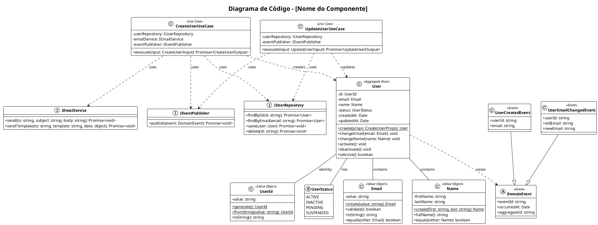
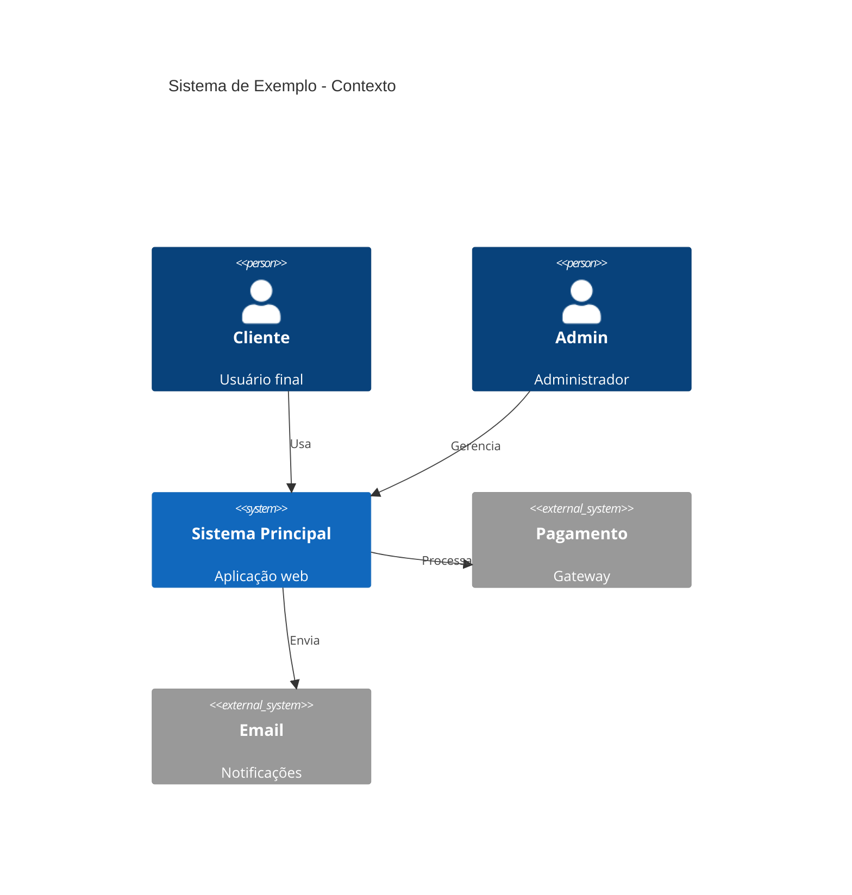
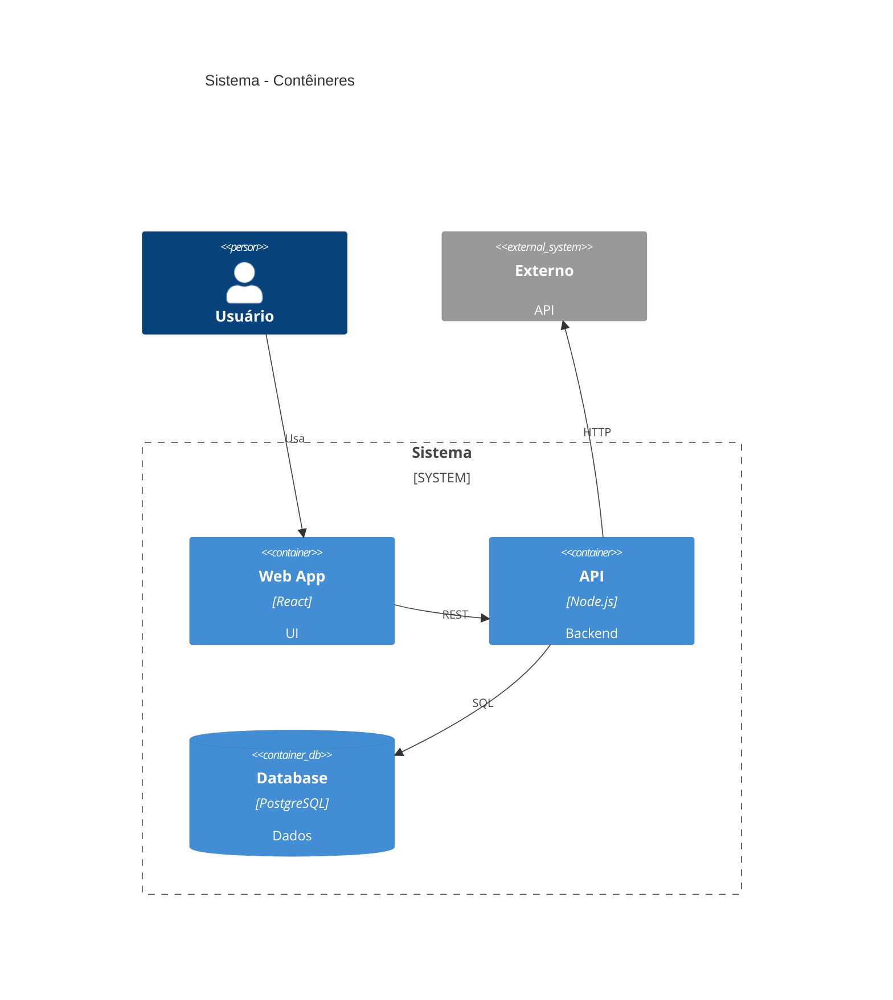

# Templates C4 Model

Templates prontos para documentação de arquitetura usando C4 Model.

---

## 1. Context Diagram - Completo

```plantuml
@startuml C4_Context
!include https://raw.githubusercontent.com/plantuml-stdlib/C4-PlantUML/master/C4_Context.puml

LAYOUT_TOP_DOWN()
LAYOUT_WITH_LEGEND()

title Sistema de [Nome] - Diagrama de Contexto

' === PERSONAS ===
Person(customer, "Cliente", "Usuário final que utiliza o sistema")
Person(admin, "Administrador", "Gerencia configurações e usuários")
Person(support, "Suporte", "Atende chamados e monitora sistema")

' === SISTEMA PRINCIPAL ===
System(system, "Nome do Sistema", "Descrição completa do que o sistema faz e seu propósito principal")

' === SISTEMAS EXTERNOS ===
System_Ext(payment, "Gateway de Pagamento", "Processa transações financeiras")
System_Ext(email, "Serviço de Email", "Envia notificações por email")
System_Ext(sms, "Serviço de SMS", "Envia notificações por SMS")
System_Ext(erp, "ERP Corporativo", "Sistema legado de gestão")

' === RELACIONAMENTOS ===
Rel(customer, system, "Usa", "HTTPS/Browser")
Rel(admin, system, "Configura", "HTTPS/Browser")
Rel(support, system, "Monitora", "HTTPS/Browser")

Rel(system, payment, "Processa pagamentos", "REST/HTTPS")
Rel(system, email, "Envia emails", "SMTP/API")
Rel(system, sms, "Envia SMS", "REST/HTTPS")
Rel_L(system, erp, "Sincroniza dados", "REST/HTTPS")

@enduml
```

---

## 2. Container Diagram - Microservices

```plantuml
@startuml C4_Container
!include https://raw.githubusercontent.com/plantuml-stdlib/C4-PlantUML/master/C4_Container.puml

LAYOUT_TOP_DOWN()
LAYOUT_WITH_LEGEND()

title Sistema de [Nome] - Diagrama de Contêineres

Person(user, "Usuário", "Usuário do sistema")

System_Boundary(system, "Sistema Principal") {

    ' === FRONTEND ===
    Container(spa, "Single Page Application", "React, TypeScript", "Interface web responsiva")
    Container(mobile, "Mobile App", "React Native", "Aplicativo iOS/Android")

    ' === API GATEWAY ===
    Container(gateway, "API Gateway", "Kong/NGINX", "Roteamento, auth, rate limiting")

    ' === MICROSERVICES ===
    Container(auth, "Auth Service", "Node.js, Express", "Autenticação e autorização")
    Container(users, "Users Service", "Node.js, Express", "Gestão de usuários")
    Container(orders, "Orders Service", "Node.js, Express", "Gestão de pedidos")
    Container(notifications, "Notifications Service", "Node.js", "Envio de notificações")

    ' === DADOS ===
    ContainerDb(authdb, "Auth DB", "PostgreSQL", "Credenciais e tokens")
    ContainerDb(usersdb, "Users DB", "PostgreSQL", "Dados de usuários")
    ContainerDb(ordersdb, "Orders DB", "PostgreSQL", "Dados de pedidos")
    ContainerDb(cache, "Cache", "Redis", "Cache e sessões")

    ' === MENSAGERIA ===
    ContainerQueue(queue, "Message Broker", "RabbitMQ", "Eventos assíncronos")
}

' === EXTERNOS ===
System_Ext(payment, "Payment Gateway", "Stripe/PagSeguro")
System_Ext(email, "Email Service", "SendGrid/SES")

' === RELACIONAMENTOS FRONTEND ===
Rel(user, spa, "Usa", "HTTPS")
Rel(user, mobile, "Usa", "HTTPS")
Rel(spa, gateway, "Consome", "REST/JSON")
Rel(mobile, gateway, "Consome", "REST/JSON")

' === RELACIONAMENTOS GATEWAY -> SERVICES ===
Rel(gateway, auth, "Roteia", "REST")
Rel(gateway, users, "Roteia", "REST")
Rel(gateway, orders, "Roteia", "REST")

' === RELACIONAMENTOS SERVICES -> DB ===
Rel(auth, authdb, "Lê/Escreve", "SQL")
Rel(auth, cache, "Cache", "Redis Protocol")
Rel(users, usersdb, "Lê/Escreve", "SQL")
Rel(orders, ordersdb, "Lê/Escreve", "SQL")

' === RELACIONAMENTOS ASSÍNCRONOS ===
Rel(orders, queue, "Publica eventos", "AMQP")
Rel(notifications, queue, "Consome eventos", "AMQP")

' === RELACIONAMENTOS EXTERNOS ===
Rel(orders, payment, "Processa", "REST")
Rel(notifications, email, "Envia", "REST")

@enduml
```

---

## 3. Container Diagram - Monolito

```plantuml
@startuml C4_Container_Monolith
!include https://raw.githubusercontent.com/plantuml-stdlib/C4-PlantUML/master/C4_Container.puml

LAYOUT_WITH_LEGEND()

title Sistema [Nome] - Arquitetura Monolítica

Person(user, "Usuário", "Usuário do sistema")

System_Boundary(system, "Sistema") {
    Container(web, "Web Application", "Next.js, React", "SSR e interface do usuário")
    Container(api, "Backend API", "Node.js, Express", "API REST e lógica de negócio")
    ContainerDb(db, "Database", "PostgreSQL", "Dados da aplicação")
    ContainerDb(cache, "Cache", "Redis", "Cache e filas")
    Container(worker, "Background Worker", "Node.js, Bull", "Jobs assíncronos")
    Container(storage, "Object Storage", "MinIO/S", "Arquivos e mídia")
}

System_Ext(email, "Email", "SMTP")
System_Ext(payment, "Pagamento", "API")

Rel(user, web, "Acessa", "HTTPS")
Rel(web, api, "Consome", "REST/JSON")
Rel(api, db, "Persiste", "SQL")
Rel(api, cache, "Cache", "Redis")
Rel(api, storage, "Upload/Download", "S API")
Rel(worker, cache, "Processa filas", "Redis")
Rel(worker, db, "Atualiza", "SQL")
Rel(api, email, "Envia", "SMTP")
Rel(api, payment, "Processa", "REST")

@enduml
```

---

## 4. Component Diagram - Clean Architecture

```plantuml
@startuml C4_Component_Clean
!include https://raw.githubusercontent.com/plantuml-stdlib/C4-PlantUML/master/C4_Component.puml

LAYOUT_WITH_LEGEND()

title API Backend - Componentes (Clean Architecture)

Container_Boundary(api, "API Backend") {

    ' === PRESENTATION LAYER ===
    Component(controllers, "Controllers", "Express Router", "Handlers HTTP, validação de entrada")
    Component(middleware, "Middlewares", "Express", "Auth, logging, error handling")
    Component(presenters, "Presenters", "TypeScript", "Formatação de resposta")

    ' === APPLICATION LAYER ===
    Component(usecases, "Use Cases", "TypeScript", "Orquestração de lógica de negócio")
    Component(dtos, "DTOs", "TypeScript", "Data Transfer Objects")
    Component(mappers, "Mappers", "TypeScript", "Conversão Entity <-> DTO")

    ' === DOMAIN LAYER ===
    Component(entities, "Entities", "TypeScript", "Entidades de domínio")
    Component(valueobjects, "Value Objects", "TypeScript", "Objetos de valor imutáveis")
    Component(domainservices, "Domain Services", "TypeScript", "Lógica de domínio complexa")
    Component(repositories_if, "Repository Interfaces", "TypeScript", "Contratos de persistência")

    ' === INFRASTRUCTURE LAYER ===
    Component(repositories, "Repositories", "TypeORM/Prisma", "Implementação de persistência")
    Component(external, "External Services", "TypeScript", "Clientes de APIs externas")
    Component(queue, "Queue Adapters", "TypeScript", "Publicação/consumo de mensagens")
}

' === EXTERNOS ===
ContainerDb(db, "Database", "PostgreSQL")
ContainerQueue(mq, "Message Queue", "RabbitMQ")
Container_Ext(ext, "External API", "Third-party")

' === FLUXO: Presentation -> Application ===
Rel(controllers, middleware, "Usa")
Rel(controllers, usecases, "Executa")
Rel(controllers, presenters, "Formata resposta")
Rel(usecases, dtos, "Usa")
Rel(usecases, mappers, "Converte")

' === FLUXO: Application -> Domain ===
Rel(usecases, entities, "Manipula")
Rel(usecases, domainservices, "Usa")
Rel(usecases, repositories_if, "Depende de")
Rel(domainservices, entities, "Opera sobre")
Rel(entities, valueobjects, "Contém")

' === FLUXO: Infrastructure (implementa interfaces) ===
Rel(repositories, repositories_if, "Implementa")
Rel(repositories, db, "Persiste")
Rel(external, ext, "Integra")
Rel(queue, mq, "Publica/Consome")
Rel(usecases, external, "Usa")
Rel(usecases, queue, "Usa")

@enduml
```

---

## 5. Component Diagram - Hexagonal (Ports & Adapters)

```plantuml
@startuml C4_Component_Hexagonal
!include https://raw.githubusercontent.com/plantuml-stdlib/C4-PlantUML/master/C4_Component.puml

LAYOUT_WITH_LEGEND()

title API - Arquitetura Hexagonal

Container_Boundary(api, "API") {

    ' === DRIVING ADAPTERS (entrada) ===
    Component(rest, "REST Adapter", "Express", "Endpoints HTTP")
    Component(graphql, "GraphQL Adapter", "Apollo", "Queries e Mutations")
    Component(grpc, "gRPC Adapter", "gRPC", "Comunicação entre serviços")
    Component(consumer, "Queue Consumer", "RabbitMQ", "Processa mensagens")

    ' === PORTS (interfaces) ===
    Component(inbound, "Inbound Ports", "TypeScript Interfaces", "Contratos de entrada")
    Component(outbound, "Outbound Ports", "TypeScript Interfaces", "Contratos de saída")

    ' === CORE (domínio) ===
    Component(application, "Application Services", "TypeScript", "Casos de uso")
    Component(domain, "Domain Model", "TypeScript", "Entidades e regras")

    ' === DRIVEN ADAPTERS (saída) ===
    Component(dbadapter, "Database Adapter", "Prisma", "Persistência")
    Component(cacheadapter, "Cache Adapter", "Redis Client", "Cache")
    Component(httpadapter, "HTTP Adapter", "Axios", "APIs externas")
    Component(publisher, "Queue Publisher", "RabbitMQ", "Publica mensagens")
}

' === EXTERNOS ===
ContainerDb(db, "Database", "PostgreSQL")
ContainerDb(cache, "Cache", "Redis")
ContainerQueue(queue, "Queue", "RabbitMQ")
Container_Ext(ext, "External API", "Third-party")

' === DRIVING -> PORTS -> CORE ===
Rel(rest, inbound, "Usa")
Rel(graphql, inbound, "Usa")
Rel(grpc, inbound, "Usa")
Rel(consumer, inbound, "Usa")
Rel(inbound, application, "Define contrato")
Rel(application, domain, "Usa")

' === CORE -> PORTS -> DRIVEN ===
Rel(application, outbound, "Depende de")
Rel(dbadapter, outbound, "Implementa")
Rel(cacheadapter, outbound, "Implementa")
Rel(httpadapter, outbound, "Implementa")
Rel(publisher, outbound, "Implementa")

' === DRIVEN -> EXTERNOS ===
Rel(dbadapter, db, "Conecta")
Rel(cacheadapter, cache, "Conecta")
Rel(publisher, queue, "Publica")
Rel(httpadapter, ext, "Chama")

@enduml
```

---

## 6. Code Diagram (Nível 4) - UML Classes



---

## 7. Mermaid - Context (alternativa sem PlantUML)



---

## 8. Mermaid - Container (alternativa sem PlantUML)



---

## Referência Rápida

### Elementos

| Elemento | Sintaxe | Uso |
|----------|---------|-----|
| Pessoa | `Person(id, "Nome", "Desc")` | Usuários do sistema |
| Sistema | `System(id, "Nome", "Desc")` | Sistema interno |
| Sistema Externo | `System_Ext(id, "Nome", "Desc")` | Terceiros |
| Contêiner | `Container(id, "Nome", "Tech", "Desc")` | Apps, APIs |
| Banco de Dados | `ContainerDb(id, "Nome", "Tech", "Desc")` | Databases |
| Fila | `ContainerQueue(id, "Nome", "Tech", "Desc")` | Mensageria |
| Componente | `Component(id, "Nome", "Tech", "Desc")` | Módulos internos |

### Relacionamentos

| Sintaxe | Descrição |
|---------|-----------|
| `Rel(from, to, "label")` | Relacionamento simples |
| `Rel(from, to, "label", "tech")` | Com tecnologia |
| `Rel_D(from, to, "label")` | Direção para baixo |
| `Rel_R(from, to, "label")` | Direção para direita |
| `Rel_L(from, to, "label")` | Direção para esquerda |
| `Rel_U(from, to, "label")` | Direção para cima |

### Boundaries

| Sintaxe | Uso |
|---------|-----|
| `System_Boundary(id, "name") { }` | Agrupa contêineres |
| `Container_Boundary(id, "name") { }` | Agrupa componentes |
| `Enterprise_Boundary(id, "name") { }` | Agrupa sistemas |

### Layouts

```plantuml
LAYOUT_TOP_DOWN()      ' Vertical (padrão)
LAYOUT_LEFT_RIGHT()    ' Horizontal
LAYOUT_WITH_LEGEND()   ' Com legenda
LAYOUT_LANDSCAPE()     ' Paisagem
```

---

## Referências

- [C4 Model](https://c4model.com/)
- [C4-PlantUML](https://github.com/plantuml-stdlib/C4-PlantUML)
- [Structurizr](https://structurizr.com/)