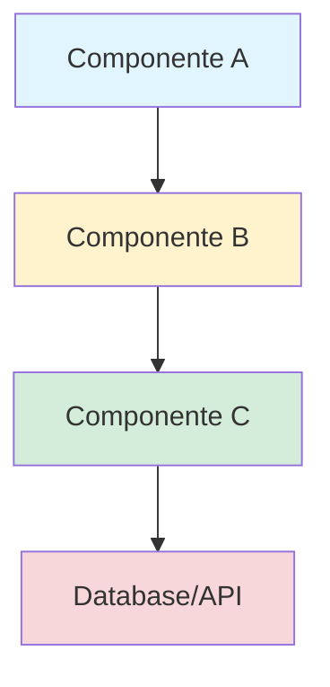
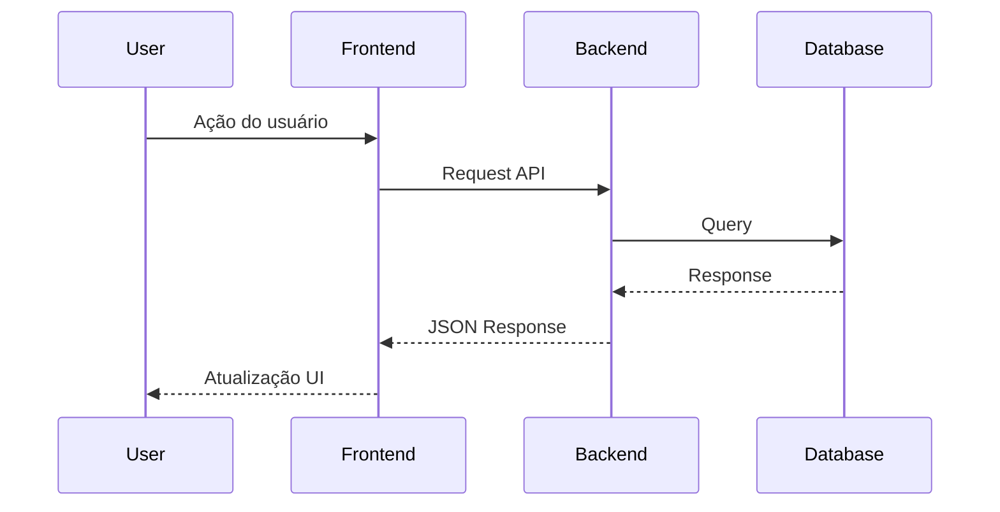

# {id}: {name}

## 1. Contexto da História

### História Original do Jira
**ID**: {STORY-XXX}
**Link**: {URL}

**Como** {tipo de usuário}
**Eu quero** {capacidade}
**Para que** {benefício/valor entregue}

### Contexto de Negócio
{Por que essa história é importante? Como se encaixa no épico/produto? Qual problema resolve?}

### Critérios de Aceitação (do Produto)
```
- Quando {condição}, então {resultado esperado}
- Quando {condição}, então {resultado esperado}
```

### Escopo
**Inclui:**
- {item 1 que ESTÁ no escopo}
- {item 2 que ESTÁ no escopo}

**Não Inclui:**
- {item 1 que NÃO está no escopo}
- {item 2 que NÃO está no escopo}

---

## 2. Análise Técnica

### 2.1 Componentes Afetados

| Componente | Tipo de Mudança | Impacto | Prioridade |
|------------|-----------------|---------|------------|
| {componente 1} | Modificação/Criação/Remoção | Alto/Médio/Baixo | P0/P1/P2 |
| {componente 2} | Modificação/Criação/Remoção | Alto/Médio/Baixo | P0/P1/P2 |

### 2.2 Arquitetura Atual vs. Proposta

**Estado Atual:**
{Descrever como o sistema funciona hoje, antes dessa implementação}

**Estado Proposto:**
{Descrever como o sistema funcionará após a implementação}

**Diagrama de Arquitetura:**


**Fluxo de Dados:**


### 2.3 Tecnologias e Bibliotecas

| Tecnologia/Biblioteca | Versão | Justificativa | Nova? |
|----------------------|--------|---------------|-------|
| {biblioteca 1} | {x.y.z} | {por que usar esta} | Sim/Não |
| {biblioteca 2} | {x.y.z} | {por que usar esta} | Sim/Não |

### 2.4 Dependências

**Dependências Externas:**
- {API/Serviço 1} - {motivo}
- {API/Serviço 2} - {motivo}

**Dependências Internas:**
- {Módulo/Funcionalidade 1} - {motivo}
- {Módulo/Funcionalidade 2} - {motivo}

**Dependências de Outras Stories:**
- {STORY-XXX} - {deve ser concluída antes/depois}

### 2.5 Decisões Arquiteturais

**Decisão 1: {Título da decisão}**
- **Contexto**: {Por que precisamos decidir isso?}
- **Opções Consideradas**:
  - Opção A: {descrição} - Prós: {x}, Contras: {y}
  - Opção B: {descrição} - Prós: {x}, Contras: {y}
- **Decisão**: {Opção escolhida}
- **Justificativa**: {Por que escolhemos esta opção}
- **Consequências**: {Impactos desta decisão}

**Decisão 2: {Título da decisão}**
{Mesma estrutura}

---

## 3. Plano de Implementação

### Visão Geral de Fases
{Breve descrição da estratégia de implementação incremental}

### Fase 1: {Nome da Fase - ex: Setup e Infraestrutura}
**Objetivo**: {Descrição do objetivo desta fase}
**Estimativa**: {X horas/dias}
**Dependências**: {Nenhuma / SUBTASK-XXX}

**Subtarefas:**

#### SUBTASK-001: {Nome da Subtarefa}
- **Descrição**: {Descrição técnica detalhada do que precisa ser feito}
- **Arquivos a Modificar/Criar**:
  - `path/to/file1.py` - {Modificação/Criação} - {Descrição}
  - `path/to/file2.tsx` - {Modificação/Criação} - {Descrição}
- **Critérios de Aceitação Técnicos**:
  - [ ] {Critério técnico 1 - como validar}
  - [ ] {Critério técnico 2 - como validar}
- **Testes Requeridos**:
  - [ ] Teste unitário: {descrição}
  - [ ] Teste de integração: {descrição}
- **Dependências**: {Nenhuma / SUBTASK-XXX}
- **Estimativa**: {X horas}
- **Prioridade**: {P0/P1/P2}

#### SUBTASK-002: {Nome da Subtarefa}
{Mesma estrutura}

---

### Fase 2: {Nome da Fase - ex: Implementação Backend}
**Objetivo**: {Descrição}
**Estimativa**: {X horas/dias}
**Dependências**: {Fase 1 / SUBTASK-XXX}

**Subtarefas:**

#### SUBTASK-003: {Nome da Subtarefa}
{Mesma estrutura da Fase 1}

---

### Fase 3: {Nome da Fase - ex: Implementação Frontend}
{Mesma estrutura}

---

### Fase 4: {Nome da Fase - ex: Testes e2e e Validação}
{Mesma estrutura}

---

## 4. Considerações Técnicas

### 4.1 Segurança
- **{Consideração 1}**: {Descrição e como endereçar}
- **{Consideração 2}**: {Descrição e como endereçar}

**Checklist de Segurança:**
- [ ] Validação de input sanitizada
- [ ] Autenticação e autorização implementadas
- [ ] Dados sensíveis criptografados
- [ ] Proteção contra OWASP Top 10
- [ ] Secrets não commitados no código

### 4.2 Performance

**Requisitos de Performance:**
- Tempo de resposta API: {< X ms no percentil 95}
- Tempo de carregamento UI: {< X segundos}
- Throughput: {X requisições/segundo}

**Otimizações Planejadas:**
- {Otimização 1} - {Justificativa}
- {Otimização 2} - {Justificativa}

**Métricas a Monitorar:**
- {Métrica 1} - {Threshold de alerta}
- {Métrica 2} - {Threshold de alerta}

### 4.3 Escalabilidade
- **Horizontal**: {Como o sistema escala horizontalmente}
- **Vertical**: {Limitações verticais}
- **Gargalos Potenciais**: {Identificar e mitigar}

### 4.4 Observabilidade

**Logging:**
- {Onde/Como fazer log}
- {Nível de log apropriado}

**Monitoring:**
- {Métricas a adicionar ao dashboard}

**Alertas:**
- {Condições que devem gerar alertas}

### 4.5 Acessibilidade
- [ ] {Padrão WCAG atendido}
- [ ] {Navegação por teclado}
- [ ] {Screen reader compatível}

---

## 5. Casos Extremos e Tratamento de Erros

### 5.1 Casos Extremos

| Cenário | Comportamento Esperado | Solução Técnica |
|---------|------------------------|-----------------|
| {Caso extremo 1} | {Como sistema deve se comportar} | {Implementação técnica} |
| {Caso extremo 2} | {Como sistema deve se comportar} | {Implementação técnica} |

### 5.2 Tratamento de Erros

| Tipo de Erro | Cenário | Mensagem ao Usuário | Ação do Sistema | Log/Monitoramento |
|--------------|---------|---------------------|-----------------|-------------------|
| Validação | {ex: Email inválido} | "Email inválido" | Rejeitar input | Warning |
| API | {ex: Timeout} | "Erro de conexão" | Retry 3x | Error |
| Sistema | {ex: DB down} | "Erro temporário" | Fallback | Critical |

### 5.3 Rollback e Recuperação
- **Estratégia de Rollback**: {Como reverter se der errado}
- **Plano de Recuperação**: {Como recuperar dados/estado}
- **Feature Flags**: {Usar? Como?}

---

## 6. Estratégia de Testes

### 6.1 Testes Unitários

**Cobertura Alvo**: {X%}

| Módulo/Função | Casos de Teste | Prioridade |
|---------------|----------------|------------|
| {módulo 1} | {caso 1, caso 2, caso 3} | Alta |
| {módulo 2} | {caso 1, caso 2} | Média |

**Exemplo de Teste:**
```python
def test_{funcionalidade}():
    # Arrange
    {setup}

    # Act
    {ação}

    # Assert
    {verificação}
```

### 6.2 Testes de Integração

| Integração | Cenário | Resultado Esperado |
|------------|---------|-------------------|
| {componente A + B} | {cenário} | {resultado} |
| {componente B + C} | {cenário} | {resultado} |

### 6.3 Testes E2E

| Fluxo de Usuário | Passos | Critério de Sucesso |
|------------------|--------|---------------------|
| {fluxo 1} | 1. {passo}<br>2. {passo}<br>3. {passo} | {como validar} |
| {fluxo 2} | {passos} | {validação} |

### 6.4 Testes de Performance
- **Load Testing**: {Simular X usuários concorrentes}
- **Stress Testing**: {Testar até X requisições/seg}
- **Ferramentas**: {ex: k6, JMeter, Lighthouse}

### 6.5 Testes de Segurança
- [ ] Teste de penetração básico
- [ ] Scan de vulnerabilidades (OWASP ZAP, Snyk)
- [ ] Revisão de dependências

---

## 7. Dados e Migrações

### 7.1 Modelo de Dados

**Novos Modelos/Schemas:**
```python
class NovoModelo:
    campo1: tipo  # descrição
    campo2: tipo  # descrição
```

**Modificações em Modelos Existentes:**
- {Modelo X}: Adicionar campo `{nome}` tipo `{tipo}`
- {Modelo Y}: Remover campo `{nome}` (deprecated)

### 7.2 Migrações de Dados

**Migração 1: {Nome}**
- **Tipo**: Aditiva/Modificadora/Destrutiva
- **Reversível**: Sim/Não
- **Script**:
```sql
-- Migração
ALTER TABLE {tabela} ADD COLUMN {coluna} {tipo};

-- Rollback (se aplicável)
ALTER TABLE {tabela} DROP COLUMN {coluna};
```
- **Validação**: {Como validar que migração foi bem-sucedida}
- **Impacto**: {Downtime? Bloqueio de tabela?}

### 7.3 Seeds e Dados de Teste
{Dados necessários para desenvolvimento/testes}

---

## 8. Deploy e Infraestrutura

### 8.1 Configurações Necessárias

**Variáveis de Ambiente:**
```bash
NEW_FEATURE_ENABLED=true
API_ENDPOINT=https://api.exemplo.com
TIMEOUT_MS=5000
```

**Feature Flags:**
- `feature_{nome}`: {descrição} - Default: {valor}

### 8.2 Estratégia de Deploy

**Tipo**: {Blue-Green / Rolling / Canary}

**Fases do Deploy:**
1. {Ambiente Dev} - {Validação}
2. {Ambiente Staging} - {Validação}
3. {Ambiente Prod} - {Validação + Monitoramento}

**Critérios de Rollback:**
- Taxa de erro > {X%}
- Latência > {X ms}
- {Outro critério}

### 8.3 Monitoramento Pós-Deploy

**Métricas a Observar (primeiras 24h):**
- {Métrica 1} - Threshold: {valor}
- {Métrica 2} - Threshold: {valor}

**Dashboards:**
- {Link para dashboard 1}
- {Link para dashboard 2}

---

## 9. Documentação

### 9.1 Documentação Técnica a Atualizar
- [ ] `README.md` - {Seção a atualizar}
- [ ] `API.md` - {Novos endpoints}
- [ ] `ARCHITECTURE.md` - {Mudanças arquiteturais}
- [ ] `CHANGELOG.md` - {Adicionar entry}

### 9.2 Documentação de Usuário
- [ ] {Guia do usuário} - {Seção}
- [ ] {FAQ} - {Perguntas a adicionar}

### 9.3 Comentários no Código
- Decisões não-óbvias devem ser comentadas
- TODOs devem incluir contexto e deadline
- Complexidade deve ser justificada

---

## 10. Riscos e Mitigações

| Risco | Probabilidade | Impacto | Mitigação | Plano B |
|-------|---------------|---------|-----------|---------|
| {Risco 1: ex: API de terceiros instável} | Alta/Média/Baixa | Alto/Médio/Baixo | {Como mitigar} | {Alternativa se falhar} |
| {Risco 2: ex: Performance degradada} | Alta/Média/Baixa | Alto/Médio/Baixo | {Como mitigar} | {Alternativa} |
| {Risco 3: ex: Complexidade subestimada} | Alta/Média/Baixa | Alto/Médio/Baixo | {Como mitigar} | {Alternativa} |

---

## 11. Validação e Critérios de Conclusão

### 11.1 Checklist de Definição de Pronto (DoD)

**Código:**
- [ ] Todas as subtarefas implementadas
- [ ] Code review aprovado (mínimo 2 aprovações)
- [ ] Sem débito técnico crítico introduzido
- [ ] Código segue padrões do projeto
- [ ] Sem warnings do linter

**Testes:**
- [ ] Testes unitários passando (cobertura > {X%})
- [ ] Testes de integração passando
- [ ] Testes E2E passando
- [ ] Testes de performance dentro dos SLAs
- [ ] Testes de segurança realizados

**Documentação:**
- [ ] Documentação técnica atualizada
- [ ] Comentários no código onde necessário
- [ ] README atualizado (se aplicável)
- [ ] CHANGELOG atualizado

**Deploy:**
- [ ] Deployed em staging e validado
- [ ] Deployed em produção
- [ ] Monitoramento configurado
- [ ] Alertas configurados
- [ ] Rollback testado

**Produto:**
- [ ] Critérios de aceitação do Jira atendidos
- [ ] Product Owner aceitou
- [ ] QA sign-off
- [ ] Stakeholders notificados

### 11.2 Validação com Stakeholders

**Data da Revisão Técnica**: {YYYY-MM-DD}
**Participantes**: {lista}
**Status**: {Draft / In Review / Approved}

**Feedback Recebido:**
- {Feedback 1} - Status: {Endereçado / Pendente}
- {Feedback 2} - Status: {Endereçado / Pendente}

---

## 12. Referências

### 12.1 Documentos Relacionados
- [PRD: {nome}]({link})
- [FRD: {nome}]({link})
- [Epic: {nome}]({link})
- [ADR: {nome}]({link})

### 12.2 Issues Relacionadas
- {STORY-XXX}: {descrição}
- {BUG-XXX}: {descrição}

### 12.3 Recursos Externos
- [Documentação da Biblioteca X]({link})
- [API Reference Y]({link})
- [Best Practices Z]({link})

---

## 13. Histórico de Revisões

| Data | Versão | Autor | Mudanças |
|------|--------|-------|----------|
| {YYYY-MM-DD} | 1.0 | {nome} | Versão inicial |
| {YYYY-MM-DD} | 1.1 | {nome} | {Descrição das mudanças} |

---

## 14. Apêndices

### Apêndice A: {Título}
{Informações adicionais, diagramas detalhados, exemplos de código, etc.}

### Apêndice B: {Título}
{Conteúdo adicional}
